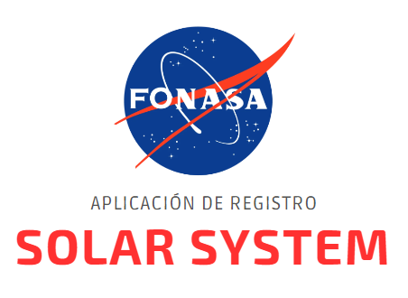

Primer ejercicio realizado en la Práctica Laboral (de técnico en Programación y Análisis de Sistemas) sobre un CRUD con JAVA, segun ruta de aprendizaje inicial, la cual se conecta a Base de Datos MySQL.

Se realiza una página web HTML con Spring Boot para administrar registros de planetas; inicialmente sólo de este sistema, pero es altamente escalable para otros sistemas planetarios y sus lunas. 
Se incluyen pruebas unitarias a las API.

## :hammer: Funcionalidades

- `Funcionalidad 1`: Home con noticias y contador de registros
- `Funcionalidad 2`: Listar Planetas con su detalle
- `Funcionalidad 3`: Editar y/o Eliminar Planetas
- `Funcionalidad 4`: Registrar Planetas

## :white_check_mark: Tecnologías utilizadas

* **Java 8**
* **Spring Boot 3.2.1**
* **Postman**
* **MySQL 5.2.0**
* **HTML5**
* **JavaScript**
* **JUnit5**
* **JACOCO**

## ✒️ Autor
Gabriela Ramírez
(https://www.linkedin.com/in/gabriela-ramirez-perez-grp)
